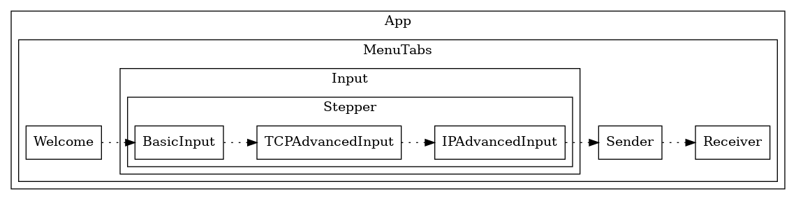
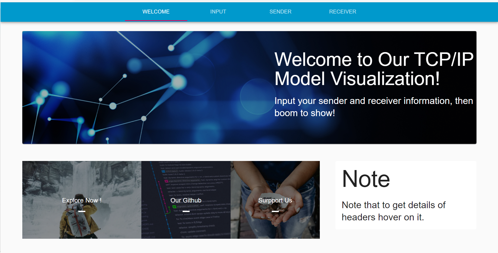
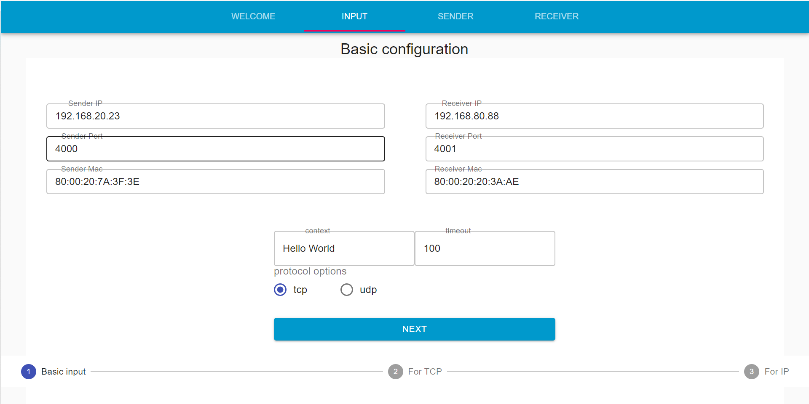
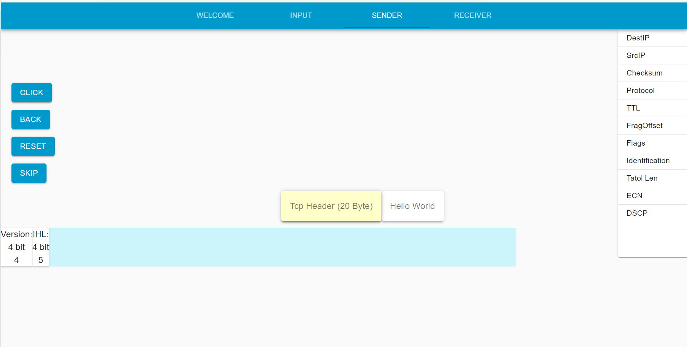
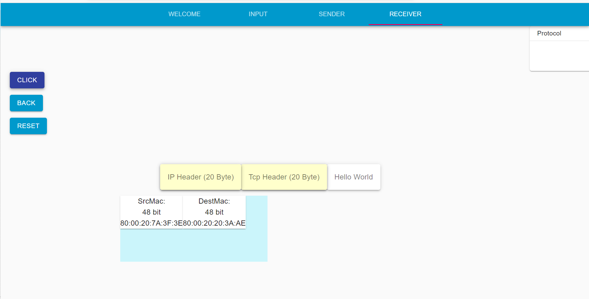

# `TCP/IP` 可视化教程设计报告

<b>1752132 王森</b>

<!-- @import "[TOC]" {cmd="toc" depthFrom=1 depthTo=6 orderedList=false} -->

<!-- code_chunk_output -->

- [`TCP/IP` 可视化教程设计报告](#tcpip-可视化教程设计报告)
  - [总体架构](#总体架构)
  - [页面间切换](#页面间切换)
  - [欢迎界面](#欢迎界面)
  - [输入界面](#输入界面)
  - [发送方界面](#发送方界面)
  - [接收方界面](#接收方界面)

<!-- /code_chunk_output -->

## 总体架构
总体上，我们这个软件是一个单页面网页。
我们的整体架构图如下：

首先，整个网页是由一个 `MenuTabs` 来控制。这也可以在单页应用中实现不同页面的转化和展示。

我们主要有四个子页面组成。
- 欢迎页面
- 输入页面
- 发送者页面
- 接收者页面

欢迎界面是我们这个应用初始化加载的页面，具体是我们这个应用的一些粗略的使用方法和我们这个项目的GitHub仓库。

输入界面的功能是输入相应的参数和配置。其中，为了完成这个功能和实现配置的分层化展示，我们这个子页面又有一个 `Stepper` 控制。
`Stepper` 控制了以下几种不同的输入。
- 基础输入
- TCP 高阶输入
- IP 高阶输入

发送者页面是发送者从应用层到传输层、网络层、数据链路层的包的头部打包的详细过程的动画展示，最终通过物理层传输往接收方。

接收者页面是发送者从物理层到数据链路层、网络层、传输层的包的头部逐步解包的详细过程的动画展示。最终接受到发送方的信息。

## 页面间切换

效果图如上所示，当前展示的页面和本应用可以展示的子页面的相关信息。

## 欢迎界面

效果图如上图所示，点击 `Explore Now!` 进入基本配置输入界面， 点击 `Our GitHub` 展示我们这个项目的仓库。

## 输入界面

效果图如上所示，下方指示目前输入配置内容完成的阶段。

## 发送方界面

效果图如上图所示，界面的右方为之前输入的基本配置，中间为打包的过程和结果。

## 接收方界面

效果图如上图所示，中间为解包的过程和结果，界面的右方为结果得到的参数。
